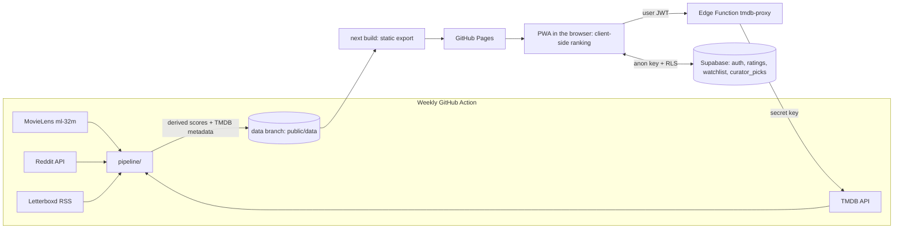

# Reel Picks: a personal movie and TV recommender

Reel Picks is a small PWA for two people (you and your family) that suggests films **and** series released in 1980 or later. It works like a Reddit thread ("if you liked *Donnie Darko* and *The Silence of the Lambs*, try…"). It blends four signals:

1. **MovieLens ml-32m** item-item similarity: rating co-occurrence plus tags, films only.
2. **Reddit** "X → Y" edges mined from r/MovieSuggestions, r/movies, r/televisionsuggestions and r/NetflixBestOf through the official API, weighted by upvotes. Edges can cross media types (a film you liked can lead to a show).
3. **TMDB** recommendations and similar titles (plus optional **Trakt** related shows) for series and for new releases that MovieLens doesn't have.
4. **Curator picks** from the people you follow: the Letterboxd RSS feeds of the curators in [`config/curators.json`](config/curators.json), plus posts you share into the app from Instagram or TikTok.

Every recommendation shows its reason, for example
`Because you liked Donnie Darko and Primer · Reddit + MovieLens · Picked by @sortedcinema · Hidden gem`.

The site is a **static Next.js export on GitHub Pages**. Ranking runs **in the browser** against a static data artifact. A weekly **GitHub Actions** pipeline rebuilds that artifact. **Supabase** (free tier) handles magic-link login, ratings and watchlist sync, and shared curator picks. A small Supabase **Edge Function** proxies TMDB for live search, so the TMDB key never reaches the browser.



> **Status:** everything runs **without any API keys**. A small bundled sample artifact (`public/data`, about 150 KB, clearly labelled "Sample data") ships with the app. Without Supabase, ratings stay on the device. Without the Edge Function, search covers the offline catalogue only.

---

## Contents

- [Quick start (no keys)](#quick-start-no-keys)
- [How the recommendations work](#how-the-recommendations-work)
- [Getting API keys](#getting-api-keys)
- [Supabase setup](#supabase-setup)
- [Add a family member](#add-a-family-member)
- [Deploy to GitHub Pages on your personal account](#deploy-to-github-pages-on-your-personal-account)
- [Alternative: keep the repo private with Cloudflare Pages](#alternative-keep-the-repo-private-with-cloudflare-pages)
- [Running the pipeline locally](#running-the-pipeline-locally)
- [Curators](#curators)
- [Install the PWA on your phone and share posts to it](#install-the-pwa-on-your-phone-and-share-posts-to-it)
- [Licensing and data notes (read before going public)](#licensing-and-data-notes-read-before-going-public)
- [Security checklist](#security-checklist)
- [Project layout and tests](#project-layout-and-tests)

---

## Quick start (no keys)

Requirements: Node 20 or later, and Python 3.11 or later.

```bash
npm install
pip install -r pipeline/requirements.txt

npm run dev                      # http://localhost:3000 with the bundled sample data
npm test && npm run test:py      # unit tests (ranking, extraction, sync, pipeline)

# Production-like check under the GitHub Pages sub-path:
NEXT_PUBLIC_BASE_PATH=/movie-recommender npm run build
NEXT_PUBLIC_BASE_PATH=/movie-recommender npm run preview   # http://localhost:4173/movie-recommender/
```

On Windows PowerShell, set the variable with `$env:NEXT_PUBLIC_BASE_PATH='/movie-recommender'` before running the command.

`npm run sample-data` regenerates the sample artifact. It runs the **real** pipeline code on synthetic MovieLens-shaped ratings, hand-written Reddit fixtures and Letterboxd RSS fixtures.

> `package-lock.json` points at `registry.npmjs.org`. If `npm ci` ever complains about the lockfile, run `npm install` once to refresh it.

## How the recommendations work

**Titles** use composite keys everywhere: `movie:603` and `tv:1396`. These keys appear in the artifact, the ranking, and the `ratings`, `watchlist` and `curator_picks` tables.

**The artifact** lives in `public/data/`. It is compact JSON with a 20 MB budget that the pipeline enforces by trimming neighbours:

| File | Contents |
|---|---|
| `meta.json` | Version, counts, genre and provider names, watch region, attribution |
| `catalog.json` | Title metadata as a column list plus rows: key, title, year, genres, poster path, runtime, TMDB rating and votes, popularity, streaming-provider ids, short overview, seasons, status (ended/ongoing) |
| `neighbors/<n>.json` | Sharded neighbour lists `[key, movielens, reddit, tmdb, trakt]` with scores from 0 to 100. The app **lazy-loads only the shards of titles you've rated** (shard = `(id*2 + isTv) % shards`). |
| `curators.json` | Public curator config plus accumulated curator picks (keys, rating, link only) |

**Ranking** runs client-side in [`src/lib/ranking.ts`](src/lib/ranking.ts):

```
s(l→c)  = Σ_source weight·score/100   (×1.15 when ≥ 2 sources agree)
sim(c)  = Σ_liked w·s(l→c)  −  0.8 · Σ_disliked |w|·s(d→c)
base(c) = sim⁺·(1 + 0.4·cur) + 0.12·cur − dislikes      cur = curator score (own curators 1.0, discovered 0.6, capped at 1.5)
score   = base · (1 + 0.3·gem)                           gem = high TMDB rating × low vote count
```

- Ratings are thumbs up/down or 1–5 stars. 3 stars counts as neutral, and 1–2 stars count as dislikes.
- Results are filtered to 1980 or later and exclude anything you've already rated. The collapsed **Filters** panel covers **Movies / TV / Both**, year range, streaming provider (TMDB watch providers, JustWatch data) and hidden gems only. You can also hide titles on your watchlist.
- **Categories:** a chip bar above the feed, always visible. Chips are multi-select, and a title matches if it has *any* selected category; **All** clears the selection. Movie and TV genre IDs map onto one set of categories in [`src/lib/categories.ts`](src/lib/categories.ts); for example, "Action & Adventure" covers movie 28 + 12 and TV 10759, and TV "Kids" counts as Family. Only categories that occur in the current list are shown, most frequent first. The selection is saved with the other filters, and **Reset** clears it too.
- **For you** has two tabs. **Based on my ratings** ranks only by similarity to what you rated; curators have no effect on it. **From curators** shows only curator picks, ordered by how well they fit your ratings, split into "Picks by followed curators" (`own: true`) and "Picks by other curators".
- Rating a card on the feed doesn't reshuffle the list: the card stays in place, dimmed, and an **Update recommendations** button re-ranks when you're ready.
- The **Picks** page lists every pick, with a curator multiselect (all selected by default; your selection is remembered).
- **More like this** on any card opens `/similar/?key=movie:603`, a list ranked only by similarity to that one title. Titles you've already rated are faded. If the title isn't in the weekly data, the page asks TMDB through the Edge Function instead.
- **Hidden gems:** a high TMDB rating with relatively few votes. Series get their vote counts scaled up (TMDB series collect about 6× fewer votes than films), and titles from the last year don't count, because few votes there just means new.
- If you rate something the artifact doesn't cover (found through live search), the app asks the Edge Function for TMDB recommendations and similar titles as a fallback.

**Title extraction** runs in [`pipeline/extract.py`](pipeline/extract.py), with a TypeScript port in [`src/lib/extract.ts`](src/lib/extract.ts) for the Share Target. It finds candidates in bold and italic text, list items (including inline `1. X 2. Y` lists), `Title (Year)` mentions, `(TV series)` and `(2008–2013)` markers for series, and "Movies/Shows like X" seed phrases. It strips hashtags, @mentions and emoji. Every candidate is then **validated against TMDB search** (`/search/movie`, `/search/tv`, `/search/multi`). An optional LLM hook is available: set `LLM_EXTRACTOR=package.module:function`, and the function receives text and returns titles.

## Getting API keys

You haven't created any keys yet. Each one below is optional apart from TMDB, which you need for a real (non-sample) artifact.

### TMDB (required for real data)
1. Create an account at <https://www.themoviedb.org/signup>.
2. Go to **Settings → API → Create → Developer** and describe it as a personal, non-commercial app.
3. Copy the **API Key (v3)**, or the **API Read Access Token (v4)**, which also works as `TMDB_READ_TOKEN`.
4. You'll store it in **two** places: as a GitHub Actions secret (`TMDB_API_KEY`) for the pipeline, and as a Supabase secret for the Edge Function. It never goes into the site build.

### Reddit (optional, recommended)
1. Log in and open <https://www.reddit.com/prefs/apps>. Click **create another app…**, choose type **script**, and set the redirect URI to `http://localhost:8080`.
2. The string under the app name is `REDDIT_CLIENT_ID`, and **secret** is `REDDIT_CLIENT_SECRET`.
3. Set `REDDIT_USER_AGENT` to something like `personal-movie-recommender/0.1 (by u/yourname)`.
4. `REDDIT_USERNAME` and `REDDIT_PASSWORD` are optional. Without them the pipeline uses app-only OAuth, which is enough for public threads.

Only derived edges and scores are stored. **No comment text, post bodies or usernames** are cached or written.

### Supabase (optional, needed for sync, login, shared picks and live search)
Create a free project at <https://supabase.com/dashboard>. Then open **Project Settings → API** and copy the **Project URL** and the **anon / publishable** key. That key is designed to be public, and row-level security protects the data. **Never** use the `service_role` or `sb_secret_…` key in the site; the build refuses to run if one ends up in a `NEXT_PUBLIC_` variable.

### Trakt (optional)
Create an app at <https://trakt.tv/oauth/applications>. The pipeline only reads public data, so use the out-of-band redirect URI `urn:ietf:wg:oauth:2.0:oob` and leave *Allowed origins* empty. Copy the **Client ID** (not the secret) into the GitHub secret `TRAKT_CLIENT_ID`. This adds "related shows" edges for series, and the footer credits Trakt once its data is used.

### Instagram Graph API Business Discovery (optional, disabled by default)
This step reads recent captions from the curators' **public Business or Creator** Instagram accounts through Meta's official API. **It only works if the target accounts are Business or Creator accounts.** Personal accounts can't be read, and the API returns an error for them, which the pipeline logs and skips. Setup:
1. Switch **your own** Instagram account to a professional (Creator or Business) account and link it to a Facebook Page.
2. Create a Meta app at <https://developers.facebook.com/apps>, add the **Instagram Graph API** product, and generate a long-lived user token with `instagram_basic` and `pages_show_list` (plus `business_management` if asked).
3. Find your Instagram professional account id (`IG_USER_ID`) with `GET /me/accounts`, then `GET /{page-id}?fields=instagram_business_account`.
4. Add the GitHub secrets `IG_USER_ID` and `IG_ACCESS_TOKEN`. Long-lived tokens expire after about 60 days, so refresh yours periodically.

The step processes captions in memory and stores **only the TMDB ids and post permalinks**. It never stores captions or media. If the variables are missing, it's skipped cleanly. It never scrapes Instagram, Facebook or TikTok.

## Supabase setup

Supabase's **Free** plan is enough for this app (500 MB database, 50,000 monthly active users, unlimited API requests). Free projects **pause after a week without activity**; the `Supabase keep-alive` workflow pings the project twice a week to prevent that. If it ever does pause, restore it from the dashboard.

Everything below can be done from the project folder with the [Supabase CLI](https://supabase.com/docs/guides/cli) (`npx supabase@2 …` works without installing it):

1. **Sign in and link:** `supabase login`, then `supabase link --project-ref <your-project-ref>`. The project ref is the `xxxx` in `https://xxxx.supabase.co`, and `supabase projects list` shows it.
2. **Schema and RLS:** `supabase db query --linked -f supabase/schema.sql` (or paste the file into the SQL editor). Then run the queries in [`supabase/checks.sql`](supabase/checks.sql); every check should come back empty or `true`. Keep **row-level security on for every table**. The schema enables it for `ratings`, `watchlist`, `curator_picks` and `tmdb_proxy_usage`, and gives no access to the `anon` role.
   - `ratings` and `watchlist`: `auth.uid() = user_id`, so each person sees only their own rows.
   - `curator_picks`: every signed-in family member can read; only the person who added a pick can insert, update or delete it. No captions or media are stored.
3. **Login settings:** edit the URLs in [`supabase/config.toml`](supabase/config.toml) for your Pages site, run `supabase config diff` to preview, then `supabase config push`. The file turns **sign-ups off** and sets the **Site URL** and **Redirect URLs**, and it changes nothing else. This family-only setup has no allow-list: people who weren't invited can't get a session, and the app shows *"This app is private — ask the owner for an invite."*
4. **Edge Function (TMDB proxy):**
   ```bash
   supabase secrets set TMDB_API_KEY=<your tmdb key> \
     ALLOWED_ORIGINS=https://<user>.github.io,http://localhost:3000 \
     PROXY_RATE_LIMIT=120 WATCH_REGION=US
   supabase functions deploy tmdb-proxy --no-verify-jwt --use-api
   ```
   The function checks the caller's **user JWT** itself with `auth.getUser`, so the public key alone is rejected. It applies a **per-user rate limit** (120 requests per hour by default, stored in `tmdb_proxy_usage`) and allows CORS only from `ALLOWED_ORIGINS`. The origin is just the scheme and host, with no path. It works with both the new `sb_publishable_…`/`sb_secret_…` keys and the legacy anon/service-role keys. If the function isn't deployed, the app falls back to searching the offline catalogue.
5. **Sessions:** the app keeps people signed in (`persistSession` plus automatic token refresh), so they rarely need to log in again.

### Login emails on the free plan

Supabase's built-in email service is meant for testing: it **only sends to members of your Supabase organization's team**, at about **2 emails per hour**, and it **doesn't allow editing email templates**. That's fine for you as the owner. For anyone else, pick one:

- **Simplest:** add them to your organization under **Organization settings → Team → Invite**, so the built-in email service will send to them. Then add them as an app user (see below).
- **Better:** connect a free email provider under **Auth → SMTP settings** (for example [Brevo](https://www.brevo.com/), [Resend](https://resend.com/) or [ZeptoMail](https://www.zoho.com/zeptomail/)). This lifts both limits and unlocks **Auth → Email Templates**. There, add `Your code: {{ .Token }}` to the **Magic Link** template: an app installed to the iPhone Home Screen can't catch the login link, but you can type the code into **Me** instead.

## Add a family member

1. Make sure Supabase can email them (see *Login emails on the free plan* above).
2. In Supabase, go to **Authentication → Users → Add user → Send invitation** and enter their email address. Or choose **Create new user** with *Auto Confirm User* ticked; that sends no email.
3. They open the app and use **Me → Send login link**, or click the invite link. That's it: they stay signed in on that device.
## Deploy to GitHub Pages on your personal account

Nothing has been pushed anywhere. This repository only has **local commits**. Follow these steps on **your personal GitHub account**:

1. **Create the repo:** on GitHub, go to **New repository**, name it `movie-recommender`, and make it **Public**. GitHub Pages on a free account requires a public repo; see the [Cloudflare alternative](#alternative-keep-the-repo-private-with-cloudflare-pages) if you want it private. Don't add a README or licence, so the first push stays clean.
2. **Add the remote and push** from this folder:
   ```bash
   git remote add origin https://github.com/<your-user>/movie-recommender.git
   git push -u origin HEAD:main      # pushes the current branch as main
   ```
3. **Enable Pages:** go to repo **Settings → Pages → Build and deployment → Source: "GitHub Actions"**.
4. **Add secrets** under **Settings → Secrets and variables → Actions → Secrets**:
   - `TMDB_API_KEY` (or `TMDB_READ_TOKEN`)
   - `REDDIT_CLIENT_ID` and `REDDIT_CLIENT_SECRET` (optional: `REDDIT_USERNAME`, `REDDIT_PASSWORD`)
   - optional: `TRAKT_CLIENT_ID`, `IG_USER_ID`, `IG_ACCESS_TOKEN`
5. **Add variables** on the **Variables** tab (these are public by design):
   - `SUPABASE_URL` and `SUPABASE_ANON_KEY`
   - optional: `WATCH_REGION` (for example `US`, `GB` or `DE`) and `REDDIT_USER_AGENT`
6. **Run it:** go to **Actions → Pipeline & Pages → Run workflow**. The pipeline job downloads MovieLens, builds the artifact and force-pushes it to a single-commit `data` branch, so history doesn't grow. The build job then tests, builds and deploys. After that it runs **every Monday** and on **every push to `main`**. Pushes reuse the latest `data` branch, or fall back to the bundled sample.
7. **Supabase redirect:** add `https://<your-user>.github.io/movie-recommender/` to **Auth → URL Configuration → Redirect URLs**, and set it as the Site URL. Also add `https://<your-user>.github.io` to the function's `ALLOWED_ORIGINS`.
8. **Turn on secret scanning and push protection:** go to **Settings → Code security → Secret scanning** and enable **Push protection**. It's free for public repos and blocks accidental key commits.

`NEXT_PUBLIC_BASE_PATH` comes automatically from `actions/configure-pages`, so the site works at `https://<user>.github.io/movie-recommender/`. The manifest `start_url` and `scope`, the service-worker scope and the share-target action all follow that path.

## Alternative: keep the repo private with Cloudflare Pages

Cloudflare Pages' free tier can build from a **private** GitHub repo, and the static export works there unchanged.

1. In the Cloudflare dashboard, go to **Workers & Pages → Create → Pages → Connect to Git** and pick the repo.
2. Set the build command to `npm run build` and the output directory to `out`. Add the environment variables `NEXT_PUBLIC_SUPABASE_URL`, `NEXT_PUBLIC_SUPABASE_ANON_KEY` and `NODE_VERSION=22`. Leave `NEXT_PUBLIC_BASE_PATH` empty, because the site is served at the root.
3. Keep the GitHub Actions `pipeline` job for weekly data, and let Cloudflare rebuild on push. Alternatively, delete the `build` and `deploy` jobs. Update the Supabase redirect URLs and `ALLOWED_ORIGINS` to your `*.pages.dev` domain.

The artifact is still publicly downloadable from the deployed site. To keep it private as well, put the site behind **Cloudflare Access** (free for small teams).

## Running the pipeline locally

```bash
cp .env.example .env.local        # fill in keys; this file is git-ignored
set -a; . ./.env.local; set +a     # or export the variables another way
python -m pipeline.download        # ~240 MB ml-32m into data/raw/ (git-ignored)
python -m pipeline.build           # writes public/data/
```

Optional sources are skipped with a warning when their keys are missing. TMDB responses are cached in `data/cache/`, which is git-ignored and cached in Actions. The first full run makes several thousand TMDB requests; later weekly runs mostly hit the cache. Useful settings are `WATCH_REGION`, `MIN_RATINGS` (default 300), `TOP_K` (50), `MAX_MOVIES` (9000), `TMDB_TV_PAGES` and `MAX_ARTIFACT_MB`. To use the full MovieLens **tag genome**, download ml-25m and set `GENOME_DIR` to the folder containing `genome-scores.csv`. Without it, the pipeline builds TF-IDF tag vectors from ml-32m `tags.csv`, because ml-32m itself ships no genome.

## Curators

The curator list lives in **[`config/curators.json`](config/curators.json)**, the single place to edit it. Both the app and the pipeline read this file, so adding a curator needs no code changes. Commit and push after editing.

| Field | Meaning |
|---|---|
| `handle` | Shown as "Picked by @handle"; unique |
| `name` | Display name |
| `instagram`, `tiktok`, `youtube` | Social usernames. They're used to recognise shared posts, and `instagram` also drives the optional Business Discovery step. |
| `letterboxd` | Username for `https://letterboxd.com/<username>/rss/`. Leave it empty to skip. |
| `own` / `weight` | Your own curators (`own: true`) use weight **1.0**; discovered ones use **0.6**. Set any value from 0 to 1. |
| `enabled` | Set `false` to switch a curator off everywhere (pipeline, ranking and share suggestions) |
| `verify` | `true` means the link between the Letterboxd account and the social account isn't confirmed yet |
| `note` | Free text |

The list currently holds your own curators (goosebumpscinema, treynesbitmovies, sortedcinema, thematthewshepherd, doradane_film, ethanneville, moviesaretherapy, nikofilmreviews, jacobstolworthy) and discovered ones (maddikoch, schaffrillas, karsten, thomasflight, davidehrlich, mattsinger, lilfilm, strangeharbors, mscorsese, davidlsims, zoerosebryant, silentdawn, suspirliam, framesofnick, jay, demiadejuyigbe, aaronkelly, jimmycthatsme, girlactress, itscharlibb, kodak_cameron, specificliz). Every Letterboxd feed in the list was checked on 2026-09-28. The `handle` doesn't have to match the Letterboxd username: Jacob Stolworthy's Letterboxd is `screenworthy`, and Aaron Kelly's is `aaron`. Entries marked `verify: true` are worth double-checking. `nikofilmreviews` has no confirmed Letterboxd account, so fill one in if you find it.

**Letterboxd RSS** is an official public feed, and no HTML is scraped. The pipeline fetches the feeds **sequentially with a 2 s delay**, identifies itself with a clear User-Agent, and fetches each curator **at most once a week**. That limit is tracked in `curators.json → lastFetched`. Diary entries rated **4★ or more**, or **liked**, become picks. The `tmdb:movieId` and `tmdb:tvId` tags are used when present; otherwise the pipeline matches title and year through TMDB. **List** entries (Martin Scorsese's feed is mostly lists) become lower-weight picks (0.5). Only 1980+ titles are kept. RSS returns only about the last 50 items, so picks **accumulate across weekly runs**: the previous `curators.json` is merged and de-duplicated per curator and title. Only keys, the star rating, the like flag and the link are stored, never review text.

## Install the PWA on your phone and share posts to it

- **Android (Chrome):** open the site, then choose menu **⋮ → Install app**. After installing, **Reel Picks appears in the Share sheet**. In Instagram or TikTok, tap **Share → Reel Picks** and the `/share` page opens. It extracts titles from the shared text, matches them through the Edge Function (or the offline catalogue), and asks you to confirm them. It also pre-selects the curator from `@handles` or the URL. Picks are saved to `curator_picks` with the curator, the post URL and who added them.
- **iPhone (Safari):** tap **Share → Add to Home Screen**. iOS doesn't support Web Share Targets for web apps, so use **Picks → Add pick** instead: choose the curator and search for the title. The same form covers Android shares that only include a URL.

The share target is declared in the generated `manifest.webmanifest` (from `src/app/manifest.ts`) with `method: GET` and `action: <basePath>/share/`, which is why it works on static hosting.

## Licensing and data notes (read before going public)

- **A public repo and site make the data artifact public.** The artifact contains **only derived neighbour scores and TMDB metadata**: never raw MovieLens ratings or tags, Reddit text or usernames, Letterboxd reviews, or Instagram captions. Tests check this.
- **MovieLens:** the [ml-32m licence](https://files.grouplens.org/datasets/movielens/ml-32m-README.html) allows research and non-commercial use only. Redistribution, *including transformations*, is allowed only under the same conditions: acknowledgement, no commercial use, and no implied endorsement by GroupLens. Publishing derived similarity scores on a public site is a redistribution of a transformation, so **that's your call**. Options include keeping the repo private (see Cloudflare above), protecting the site with Cloudflare Access, or hosting `public/data` in a **private storage bucket** (for example a private Supabase Storage bucket with signed URLs) instead of the public site. The raw dataset is never committed: `data/` is git-ignored.
- **Reddit:** data is accessed through the official API under Reddit's Developer Terms for personal, non-commercial use. Only aggregated edges are kept.
- **TMDB:** attribution is shown in the app footer, as TMDB requires. Streaming availability comes from **JustWatch** through TMDB and is credited there too.
- **Letterboxd:** only its official public RSS feeds are used. The site itself is never scraped.
- **Instagram, Facebook and TikTok** are never scraped. Picks come from posts you share yourself, or optionally from Meta's official Business Discovery API.

## Security checklist

- Sign-ups are **off**, and people are invited from the dashboard.
- **RLS is on for every table** (run `supabase/checks.sql`).
- Only the **anon/publishable** key goes in the site. `next.config.mjs` refuses to build if a `NEXT_PUBLIC_*` variable looks like a secret or a `service_role` key.
- The TMDB key exists only in GitHub secrets (pipeline) and Supabase secrets (Edge Function).
- The Edge Function requires a **user JWT** and applies a **per-user rate limit** and an **origin allow-list**.
- `.env`, `.env.local`, `.env.*`, `data/` (raw and cache) and `ml-32m/` are git-ignored.
- **Secret scanning and push protection** are enabled on GitHub.

## Project layout and tests

```
config/curators.json        curator list (single source of truth)
pipeline/                   Python data pipeline (weekly in Actions)
  build.py                  entry point (--sample for offline mode)
  movielens.py              item-item similarity (ratings + tags)
  reddit.py extract.py      Reddit mining + title extraction (films vs series)
  tmdb.py trakt.py          TMDB client/resolver, optional Trakt
  curators.py               Letterboxd RSS, optional Instagram, pick history
  artifact.py               artifact writer (sharding, size budget)
  sample/                   seed catalogue + fixtures (Reddit, Letterboxd diary + list feeds)
  tests/                    pytest
src/lib/                    client-side ranking, extraction, artifact loader, store/sync, proxy client
src/app/                    pages: feed, onboarding, search, picks, share, watchlist, account
public/sw.js                service worker (scope = base path)
public/data/                artifact (bundled sample; replaced by the data branch in CI)
supabase/schema.sql         tables + RLS; checks.sql sanity checks
supabase/functions/tmdb-proxy  Edge Function
.github/workflows/deploy.yml   pipeline + Pages deploy
```

Run the tests with `npm test` (Vitest: ranking with mixed media and curator picks, extraction, sync merge, keys and catalogue search) and `npm run test:py` (pytest: extraction including captions and films vs series, Reddit edge mining, artifact merge and sharding, Letterboxd diary and list feeds, pick history, and a sample build that asserts only derived data is written).
